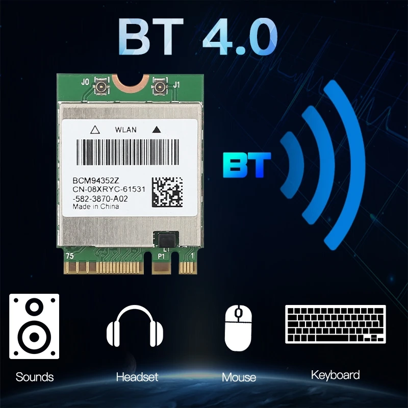

# Hackintosh Opencore Acer Nitro 5 AN515-55-51QY

Building a hackintosh on my laptop, sharing a config that works out of the box.
<!--  -->

## Table of Contents

- 🔧 [System Configuration](#system-configuration)  
- ✅ [What's Working](#whats-working)  
- ⚠️ [What's Not Yet Working](#whats-not-yet-working)  
- ❌ [What Will Never Work](#what-will-never-work)  
- 📡 [About Bluetooth & WiFi](#about-bluetooth--wifi)  
  - 🧪 [Methodology](#methodology)  
  - 📚 [Consequences](#consequences)  
    - 🧩 [Kexts Side](#kexts-side)  
    - 🛠️ [OCLP Patching](#oclp-patching)  
    - 👨🏻‍🔧 [bluetoothExternalDongleFailed Issue](#bluetoothexternaldonglefailed-issue)  
- 🙏 [Credits](#credits)

---
## System Configuration

| Specifications | Details       | PCI path / Hardware ID |
| ------------- | ------------- |----------------------- |
| Laptop Model  | [Acer Nitro 5 AN515-55-51QY](https://www.acer.com/fr-fr/laptops/nitro/nitro-5/pdp/NH.QB2EF.004) |-|
| Processor     | Intel i5-10300H (Comet Lake) |`ACPI\GenuineIntel_-_Intel64_Family_6_Model_165`|
| Graphics      | Intel UHD 630 & Nvidia RTX 3060 | iGPU - Intel UHD 630 :  `PCI\VEN_8086&DEV_9BC4&SUBSYS_143D1025&REV_05`  dGPU - Nvidia RTX 3060 :  `PCI\VEN_10DE&DEV_2520&SUBSYS_143E1025&REV_A1`|
| RAM           | 16GB - 2x (Micron 8ATF1G64HZ-3G2J1 8GB DDR4-3200 (1600 MHz) SDRAM) |-|
| Disk          | - SSD PCIe NVMe 128GB (macOS) (old) :   MZVLW128HEGR-000L2   - SSD PCIe NVMe 1TB (macOS) (new) :   WD PC SN740 SDDPTQD-1T00   - SSD PCIe NVMe 512GB (Windows):  MZVLQ512HBLU-00B00    | - |
| Audio         | Realtek HD Audio ALC295 |`INTELAUDIO\FUNC_01&VEN_10EC&DEV_0295` `&SUBSYS_1025143D&REV_1000`|
| Ethernet      | Realtek - Killer E2600 Gigabit Ethernet Controller |`PCI\VEN_10EC&DEV_2600&SUBSYS_143D1025&REV_21`|
| Wifi          | Realtek - Intel(R) Wi-Fi 6 AX201 160MHz |`PCI\VEN_8086&DEV_06F0&SUBSYS_00748086&REV_00`|
| Bluetooth     |  - Realtek - Intel(R) Wi-Fi 6 AX201 160MHz   - Broadcom BCM94352z |`PCI\VEN_8086&DEV_06F0&SUBSYS_00748086&REV_00`   `PCI\VEN_14E4&DEV_43B1&SUBSYS_072A14E4&REV_03` |

- OpenCore 0.9.8
- macOS Ventura 
- macOS Sonoma 14.3.1 
- macOS Sonoma 14.5 (latest version)

## What's working

- [x] iGPU
- [x] Built-in monitor (refresh rates 60Hz & 144Hz, brightness control)
- [x] Native hotkey support with Fn keys (keyboard & screen brightness, volume, sleep, Touchpad.)
- [x] Smart Touchpad + Gestures
- [x] Audio (built-in Speaker & mic, combo jack after sleep-wake )
- [x] USB ports as 3.1 (3xUSB Type-A + 1 USB Type-C)
- [x] Ethernet
- [x] WiFi (2.4GHz and 5GHz)
- [x] Bluetooth
- [x] Webcam
- [x] Sleep + Wake
- [x] Battery percentage
- [x] iServices (Messages, FaceTime, Handoff, Continuity, etc.) => Must edit `config.plist`'s PlatformInfo section. :warning: Never reuse existing info, generate your own! Else AppleID will be banned :warning: Discussed [here](https://github.com/iwissemben/Hackintosh-Opencore-Acer-Nitro-5-AN515-55-51QY/discussions/7#discussion-6646243)

## What's not (yet) working

- [ ] Audio (Combo jack hissing at startup, AirPods work perfectly)
- [ ] Battery readouts (cycle count, temperature)

## What will never work
- [ ] RTX 3060 (macOS does not support Nvidia's Ampere (30XX) GPUs).
- [ ] HDMI port (since it's powered by the RTX 3060).

## About Bluetooth (& WiFi)

  

Getting Bluetooth and AirDrop as well as Continuity and Handoff services to work was too much of a struggle with the Intel WiFi card. These features were working randomly and the AirPods kept getting disconnected.

I found out that some 2-in-1 cards were natively supported by macOS and worked out of the box (OOTB) (or at least until Sonoma). For Sonoma and above, kexts would be able to bring back full functionality to those specific cards.

That is why I chose to <b>transition</b> from the Intel WiFi AX201 Card with a <b>[Fenvi Broadcom BCM94352z](https://www.fenvi.com/product_detail_40.html)</b> that can be found at an unbeatable price in many stores.

For many tutorials, this Broadcom card is considered as a <u><b> "Modern WiFi card" "Non-Apple AirPort and Non-Fenvi Card" </b></u>, the Bluetooth part as a separate dongle.

### Methodology
In a spirit of consistency and continuity, I chose to add Broadcom support using the latest version of my EFI ([v1.2.0](https://github.com/iwissemben/Hackintosh-Opencore-Acer-Nitro-5-AN515-55-51QY/releases/tag/V.1.2.0)) as base before continuing to upgrade the non-related kexts and bootloader.

Thus everything detailed below uses the same OpenCore bootloader version (V.0.9.8), and kexts versions (except for the `Lilu.kext`).

### Consequences

#### Kexts side

To enable support of the Broadcom BCM94352z WiFi/Bluetooth card here is what has changed on a Kext level, and in the future all kexts will only be updated. 
- First, all Intel AX201 related kexts are disabled (but not deleted) : 
    - `IntelBluetoothFirmware.kext`
    - `IntelBTPatcher.kext`
    - `AirportItlwm.kext`

- Secondly, new Broadcom BCM94352z kexts are added :
    - `AMFIPass.kext`: Disable AMFI (Apple Mobile File Integrity) without requiring supplementary boot-args, thus allows OCLP root patching. 
        - To handle this kext's functionality with EFI ([v1.2.0](https://github.com/iwissemben/Hackintosh-Opencore-Acer-Nitro-5-AN515-55-51QY/releases/tag/V.1.2.0)), `Lilu.kext` had to be updated (1.6.7 -> 1.7.0)

    - WiFi Kexts:
        - `IOSkywalkFamily.kext`
        - `IO80211FamilyLegacy.kext`
        - `AirPortBrcmFixup.kext`

    - Bluetooth kexts:
        - `BrcmBluetoothInjector.kext` *macOS VerDep
        - `BrcmFirmwareData.kext` *macOS VerDep
        - `BrcmPatchRAM.kext` *macOS VerDep
        - `BrcmPatchRAM2.kext` *macOS VerDep
        - `BrcmPatchRAM3.kext` *macOS VerDep

- `BlueToolFixup.kext` has to be kept on to enable Bluetooth functionality in either case.

> [!IMPORTANT]
>
> *macOS VerDep: Kexts are Kernel version dependent to allow their dynamic activation, more info [on utilizing `minKernel` and `maxKernel` settings](https://github.com/5T33Z0/OC-Little-Translated/tree/main/10_Kexts_Loading_Sequence_Examples#utilizing-minkernel-and-maxkernel-settings).

> [!IMPORTANT]
>
> To bring back Intel AX201 support, disable Broadcom's kexts except `BlueToolFixup.kext` as it is used to enable WiFi functionality in either case.

#### OCLP patching
As Apple removed support of unsoldered Broadcom WiFi/Bluetooth cards since Sonoma, in addition to kexts, the Broadcom BCM94352z requires OCLP patching to work again. OCLP patching is a process of customizing the OpenCore bootloader.
- Using it needs the [OpenCore Legacy Patcher app](https://dortania.github.io/OpenCore-Legacy-Patcher/) (min version `2.4.0`) 
- Requires to:
    - <u> Disable</u> `SecureBootModel`
    - <u> Partially disable</u> System Integrity Protection (`SIP`)
    - <u> Disable</u> Apple Mobile File Integrity (`AMFI`)

> [!IMPORTANT]
>
> `SecureBootModel` can be re-enabled after Root patching.

> [!IMPORTANT]
>
> `AMFI` can be disabled by adding the `amfi=0x80` boot-arg to the NVRAM, or using `AMFIPass.kext`. I chose the latter as it is 'more visible and clean' than the boot-arg method.
> More information on the matter [here](#Credits).

#### bluetoothExternalDongleFailed
Despite adding a `bluetoothExternalDongleFailed = 00` entry to the NVRAM ([see guides](#Credits)), Bluetooth (and AirDrop) were disabled after a cold boot. To make it work I had to reset NVRAM twice after each cold boot. 

After some investigation, I saw that after each cold boot `bluetoothExternalDongleFailed` kept getting reset to `01`.

Resetting NVRAM twice each time being laborious, I discovered [Lawrence Bates/LBates2000](#Lawrence_Bates_LBates2000)'s trick to reset it to `00` on startup.

While Lawrence's solution didn't work for me (probably because I'm not on macOS Sequoia yet) it set me on the right track to solve the issue.

Please see the tutorial to fix it [here](/Documentation/Broadcom_BCM94352z/bluetoothExternalDongleFailed-fix.md)

---
#### Credits

##### [5T33Z0 Guides](https://github.com/5T33Z0)
For giving very detailed guide to add WiFi/BT support using the broadcom card.
Taught me to use `minKernel` and `maxKernel` settings on Kexts as well as OCLP.

###### OCLP4Hackintosh
- https://github.com/5T33Z0/OCLP4Hackintosh/blob/main/Enable_Features/WiFi_Sonoma.md#instructions-broadcom-and-atheros

###### OC-LittleTranslated

- https://github.com/5T33Z0/OC-Little-Translated/tree/main/10_Kexts_Loading_Sequence_Examples#example-10-re-enabling-legacy-broadcom-and-intel-wifibt-cards-in-macos-14
- https://github.com/5T33Z0/OC-Little-Translated/tree/main/10_Kexts_Loading_Sequence_Examples#example-7-broadcom-wifi-and-bluetooth

##### [EliteMacX68 Guides](https://elitemacx86.com/pages/home/)
For giving detailed guide to add WiFi/BT support using the broadcom card.
Guide on OCLP procedure.
- https://elitemacx86.com/threads/how-to-fix-broadcom-wifi-on-macos-sonoma-and-later.1415/page-15
- https://elitemacx86.com/threads/wifi-compatibility-list-for-os-x-and-macos-broadcom-atheros-intel-and-realtek.609/
- https://elitemacx86.com/threads/how-to-enable-broadcom-wifi-and-bluetooth-on-macos-clover-opencore.606/

##### Chriswayg
For giving an introductory framework to add WiFi support using the broadcom card.
- https://chriswayg.gitbook.io/opencore-visual-beginners-guide/advanced-topics/open-core-legacy-patcher-oclp/broadcom-wifi-on-macos-sequoia

##### Lawrence Bates/LBates2000
For fixing the NVRAM setting `bluetoothExternalDongleFailed` that keeps getting reset to `01` (Failed/disabled) despite specifing its value as an NVRAM entry in the `config.plist`.
- https://www.insanelymac.com/forum/topic/360799-hackintosh-bluetooth-reset-fix/
- https://gist.github.com/LBates2000/32be3c79dd987e72b98bb669c43fccbf